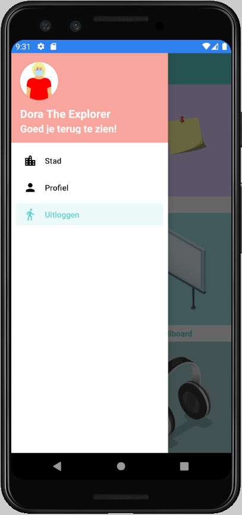

# GROW.
> Het is een safe place waar jongeren hun emoties in een veilige omgeving kunnen delen en uiten.
Het is de bedoeling van de app om de jongeren op te volgen en dat ze het kunnen meenemen later in hun leven. 
We geven de jongere tools zodat
  > - de communicatie tussen jongeren en begeleider verbetert 
  > - ze hun emoties leren uiten op verschillende manieren
  > - ze hun emoties kunnen opslaan zodat ze het later kunnen gebruiken en terug naar kunnen gebruiken

## Inhoudstabel
* Algemene informatie
* Technologieën
* Screenshots
* Login gegevens
* Status
* Extra
* Contact

## Algemene informatie
We hebben de opdracht gekregen van HOGENT om voor het vak Projecten-Workshops III: mobile apps volgende zaken te maken voor een externe klant: 
- 1 Androidapplicatie
- 1 Angular website
- Gedeelde backend

 Alle drie functioneel, robuust, onderhoudbaar en gebruiksvriendelijk
 (we hebben ook een tabletversie voorzien) 

## Technologieën
- Kotlin

## Screenshots
|   |  |
| ------------- | ------------- |
|   |    |
|   |   |
|   |   |
|   |   |
|   |   |
|   |   |
|   |   |
|   |   |

## Login gegevens
- Jongere
  - Email: dora.theexplorer1999@gmail.com
  - Wachtwoord: ZwieberNee!NietStelen1
  
## Status
12/10 - sprint2
- Layout files
  - Bulletinboard
  - Login
  - Home
- Viewmodels toegevoegd

26/10 (sprint3)
- Toevoegen item
- Deployment
- Afwerken API connecties
- Billboard
  - Layout
  - Recyclerview
  - Functionaliteit
- Prikbord Viewmodel afwerken
- Wolkenkrabber
  - Layout
  - Implementatie aanmaken doel
  - Details bekijken doel

09/11 (sprint4)
- CI/CD pipeline
- Profiel layout
- Layout foto toevoegen
- Toevoegen post
- Aanpassen doel (wolkenkrabber)
- Toevoegen item (rugzak)
- Toevoegen item (schatkist)
- Implementatie inloggen jongeren
- Layout video toevoegen
- Implementatie video toevoegen

23/11 (sprint5)
- Homescreen redesign
- Layout
  - Rugzak
  - Schatkist
  - Billboard (aanpassen)
  - Wolkenkrabber (aanpassen)
  - Audio toevoegen
  - Music club
  - Winkelcentrum
  - Landscape mode
  - Tablet versie
- Implmentatie Music club
- Implementatie audio
- Implementatie avatar aanpassen 
- Functionaliteiten Profiel
- Prikbord delete all knop
- Rugzak filteren posts
- Uitloggen
- Refactoring
- Repository pattern toepassen

07/12 (sprint6)
- Navigatie animatie toevoegen
- Implementatie avatar aanpassen
- Lifecycle
- Refactoring
- Repository pattern toepassen
- Lay-out responsive maken 
- Dark modus
- Repository pattern toepassen
- Delen Billboard (naar de groepen)
- Errorhandling
- Testen geschreven
- Documentatie
- Winkelcentrum (kleine aanpassingen)

Project moet tegen week 15 beschikbaar zijn voor de klant om het te testen

## Extra
- Document genereren
  - ./gradlew dokkaHtml
  
## Contact
- Adam Vromman
  - adam.vromman@student.hogent.be
- Audrey Behiels
  - audrey.behiels@student.hogent.be
- Anthony James
  - anthony.james@student.hogent.be
- Azize Ergun
  - azize.ergun@student.hogent.be
- Jule Dekyvere
  - jule.dekyvere@student.hogent.be
- Lukas Kindt
  - lukas.kindt@student.hogent.be
